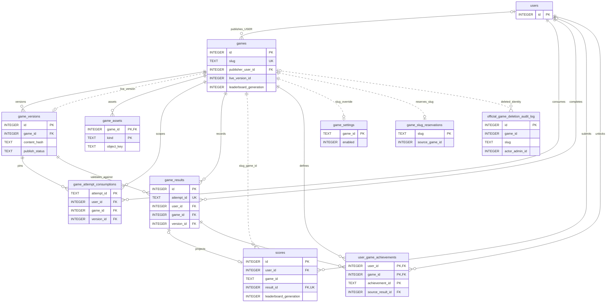
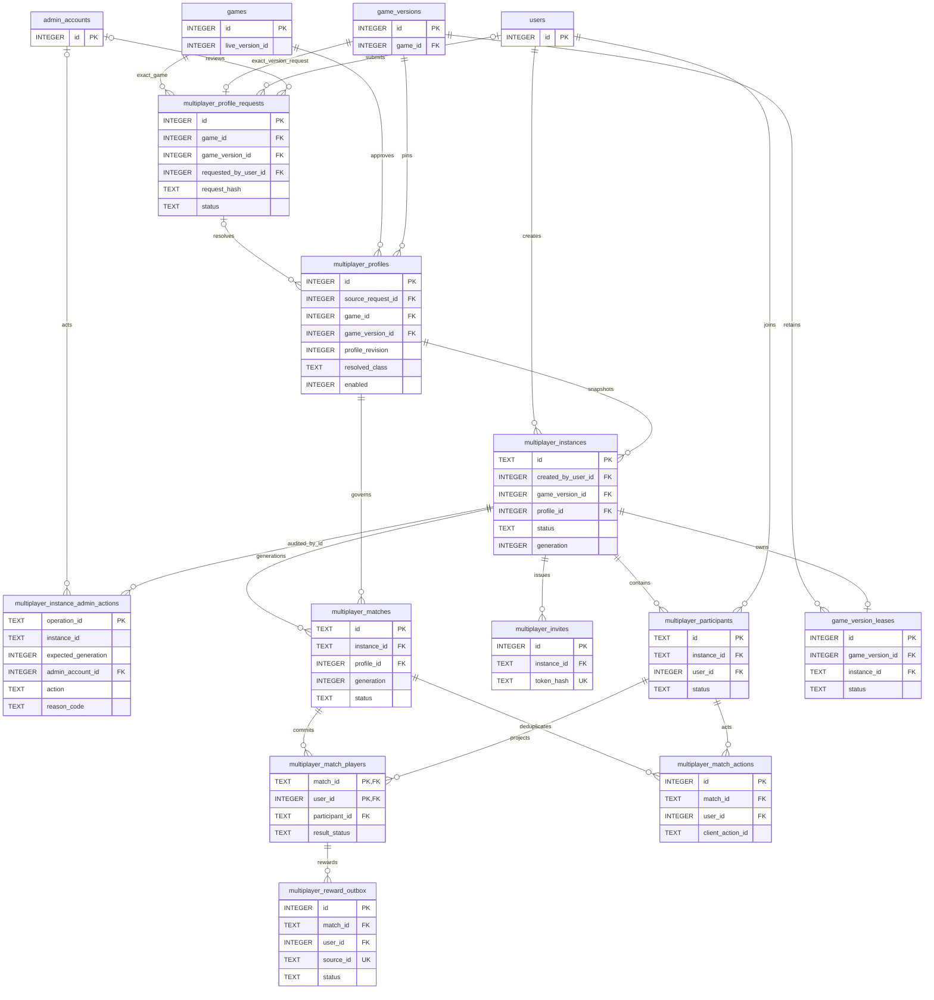
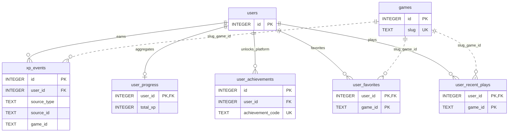
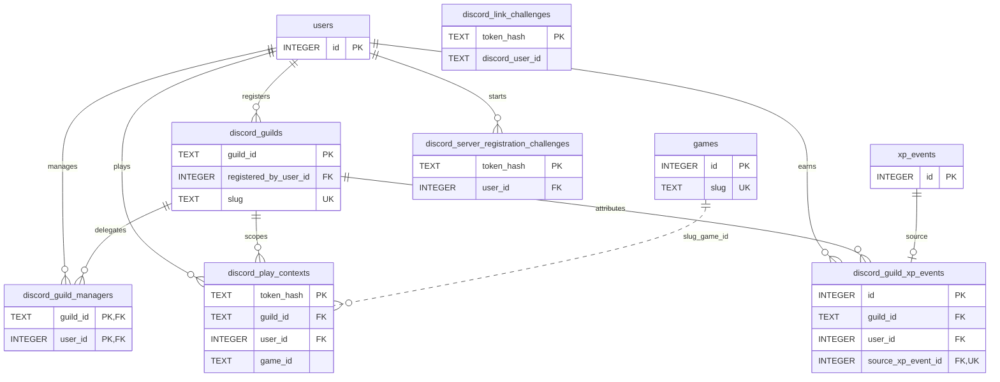
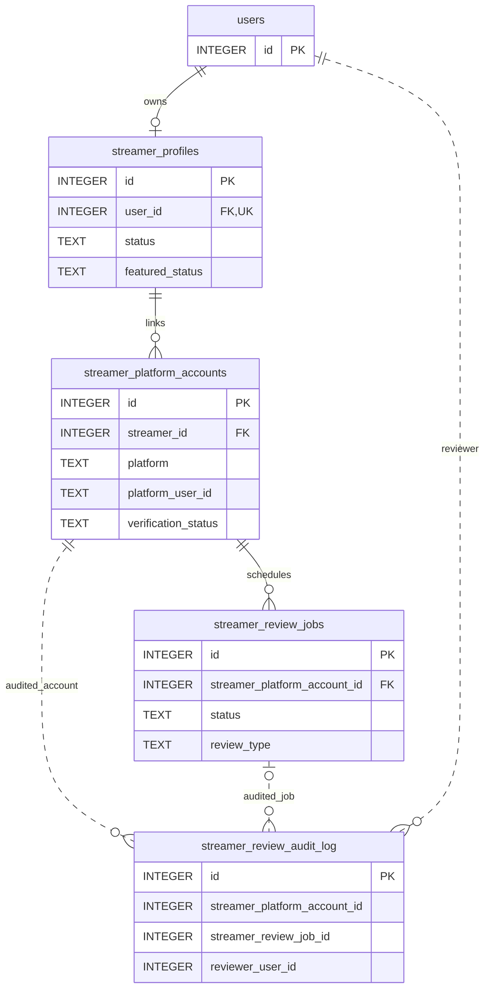
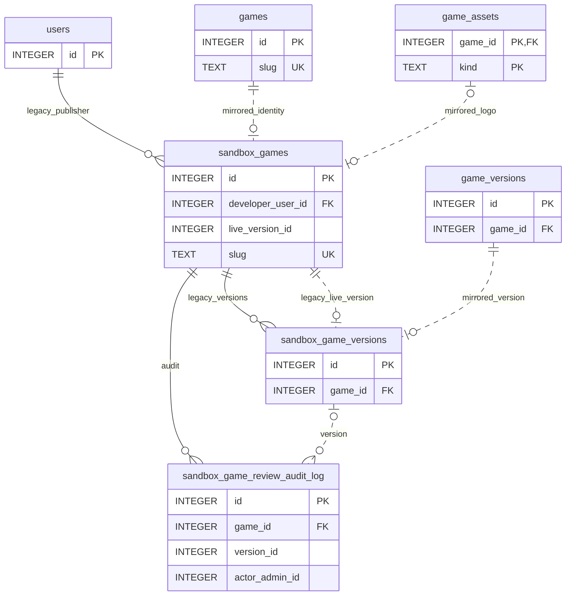

# OwOGG D1 ERD

상태: 기준 문서

마지막 검증: 2026-08-25

최신 마이그레이션: `0041_multiplayer_foundation.sql`

스키마 요약: 물리 테이블 `55`, 롤링 배포 호환 뷰 `4`

기준 소스:

- `packages/db/migrations/`
- `packages/db/src/d1/`
- `apps/api/src/container.ts`
- [데이터베이스 기준 문서](DATABASE.md)

이 문서는 `0000_initial_schema.sql`부터 `0041_multiplayer_foundation.sql`까지를 빈 SQLite에
순서대로 적용한 **최종 D1 schema**를 기준으로 합니다. migration SQL이 유일한 schema 권한
원천이며, 이 문서는 관계 탐색과 운영 이해를 위한 투영입니다.

## 표기 규칙

- `--`: D1/SQLite `FOREIGN KEY`가 강제하는 관계
- `..`: FK가 없는 논리 관계. 애플리케이션, unique index 또는 trigger가 일관성을 강제하거나
  삭제 뒤에도 감사 원장을 보존하기 위해 의도적으로 FK를 두지 않습니다.
- `||`, `o|`, `|{`, `o{`: 각각 정확히 1, 0 또는 1, 1 이상, 0 이상 cardinality입니다.
- diagram에는 관계를 이해하는 데 필요한 key만 표시합니다. 전체 column, check, index와 trigger는
  migration SQL을 확인합니다.
- `creator_*`는 Game Creator 테이블이 아닙니다. `0039` 이전 Streamer 명칭을 위한 호환 뷰만
  별도로 남아 있습니다.

## 1. 사용자, 인증, 관리자와 제재

```mermaid
erDiagram
  users {
    INTEGER id PK
    TEXT nickname
    TEXT avatar_provider
  }
  oauth_accounts {
    INTEGER id PK
    INTEGER user_id FK
    TEXT provider
    TEXT provider_user_id
  }
  sessions {
    TEXT id PK
    INTEGER user_id FK
    TEXT expires_at
  }
  account_merge_challenges {
    TEXT id PK
    INTEGER user_a
    INTEGER user_b
  }
  user_moderation {
    INTEGER user_id PK, FK
    TEXT status
    TEXT suspended_until
  }
  user_moderation_audit_log {
    INTEGER id PK
    INTEGER user_id
    INTEGER actor_admin_id
  }
  admin_accounts {
    INTEGER id PK
    INTEGER user_id FK, UK
    TEXT role
    TEXT status
  }
  admin_permission_grants {
    INTEGER id PK
    INTEGER account_id FK
    TEXT permission
  }
  admin_role_permissions {
    TEXT role PK
    TEXT permission PK
  }
  admin_account_audit_log {
    INTEGER id PK
    INTEGER actor_admin_id FK
    INTEGER target_admin_id FK
  }
  admin_sessions {
    INTEGER id PK
    INTEGER user_id
    TEXT token_hash UK
  }
  admin_step_up_challenges {
    INTEGER id PK
    INTEGER user_id
    TEXT token_hash UK
  }
  admin_login_attempts {
    INTEGER id PK
    INTEGER user_id
    INTEGER success
  }
  game_creator_access {
    INTEGER user_id PK, FK
    INTEGER granted_by_admin_id
    TEXT status
  }
  game_creator_access_audit_log {
    INTEGER id PK
    INTEGER target_user_id
    INTEGER actor_admin_id
  }
  game_creator_applications {
    INTEGER id PK
    INTEGER user_id FK
    INTEGER reviewed_by_admin_id FK
    TEXT status
  }

  users ||--o{ oauth_accounts : owns
  users ||--o{ sessions : authenticates
  users ||..o{ account_merge_challenges : user_a
  users ||..o{ account_merge_challenges : user_b
  users ||--o| user_moderation : has
  users ||..o{ user_moderation_audit_log : target
  users ||--o| admin_accounts : staff_identity
  users ||..o{ admin_sessions : elevates
  users ||..o{ admin_step_up_challenges : verifies
  users ||..o{ admin_login_attempts : attempts
  admin_accounts o|--o{ admin_accounts : creates
  admin_accounts ||--o{ admin_permission_grants : receives
  admin_accounts o|--o{ admin_permission_grants : granted_by
  admin_accounts o|--o{ admin_role_permissions : grants
  admin_accounts o|--o{ admin_account_audit_log : actor_or_target
  admin_accounts ||..o{ user_moderation_audit_log : acts
  users ||--o| game_creator_access : entitled
  users ||--o{ game_creator_applications : applies
  users ||..o{ game_creator_access_audit_log : target
  admin_accounts ||..o{ game_creator_access : grants
  admin_accounts o|--o{ game_creator_applications : reviews
  admin_accounts ||..o{ game_creator_access_audit_log : acts
```



`admin_sessions`, step-up challenge와 login attempt의 `user_id`는 인증 정리와 감사 조회에 사용하는
논리 참조입니다. 사용자 삭제 시 별도 보존/정리 정책을 적용할 수 있도록 migration에는 FK가
없습니다. 관리자·사용자 제재 감사 원장도 대상 row 삭제 뒤 증거를 보존해야 하는 column은 논리
참조로 유지합니다.

## 2. 공통 Game Platform, 결과와 랭킹



`games.live_version_id`는 `game_versions`를 가리키지만 forward cycle 때문에 formal FK 대신 trigger가
같은 game의 version인지 강제합니다. `scores.game_id`, `game_settings.game_id`는 역사적으로 생성된
TEXT slug이며 현재 `games.slug`와 논리적으로 연결됩니다. `scores.result_id`는 partial unique index로
하나의 검증된 결과에서 최대 하나의 랭킹 projection만 만들 수 있습니다.

공식 게임 완전 삭제 감사 원장은 부모 `games` row가 사라진 뒤에도 남아야 하므로 FK를 두지
않습니다. `game_slug_reservations`도 USER 호환 identity 수렴 기간의 slug 불변식을 유지하는 논리
테이블입니다.

## 3. Multiplayer control plane과 canonical match



Creator request는 권한이 아니며 exact USER publisher/version과 관리자 결정을 trigger가 확인합니다.
Profile semantic은 revision 단위로 immutable하고 exact READY version당 enabled row는 최대 하나입니다.
Instance의 live simulation state는 D1이 아니라 한 Durable Object가 소유합니다.

Match action은 `(match, user, client_action_id)`로 멱등이고 canonical player result 전체가 committed되기
전에는 match를 `COMMITTED`로 바꿀 수 없습니다. reward outbox는 committed eligible player와 profile
policy에 묶입니다. active `game_version_leases`가 있으면 해당 bundle version 삭제가 거절됩니다.
`multiplayer_instance_admin_actions`는 operation ID로 강제 종료 replay를 식별하며 update/delete가
금지된 감사 원장입니다.

계정 병합은 충돌 preflight 뒤 participant의 `user_id`를 변경하며 match player/action/outbox가
`ON UPDATE CASCADE`로 함께 이동합니다. terminal result/action payload/source semantics는 trigger가
계속 immutable하게 유지합니다.

## 4. XP, 도전과제와 개인화



`xp_events`가 XP 원장이며 `user_progress`는 빠른 조회를 위한 집계입니다. `source_type + source_id`는
score/result 등 여러 원천을 가리키는 polymorphic idempotency key라 단일 FK로 표현하지 않습니다.
favorites와 recent plays의 game key 역시 기존 TEXT slug 계약을 유지합니다.
두 테이블의 `(user_id, game_id)` PK 때문에 game별 행 수는 각각 고유 플레이 사용자 수와 현재
북마크 사용자 수입니다. `0040`은 공개 카탈로그 집계가 user-first PK 전체를 훑지 않도록 두 테이블에
`(game_id, user_id)` covering index를 추가하며 새 물리 테이블은 만들지 않습니다.

## 5. Discord 길드와 XP 귀속



`discord_link_challenges`는 OwOGG user가 확정되기 전 Discord identity를 잠시 보관하므로 user FK가
없습니다. `discord_guild_xp_events.source_xp_event_id`의 unique 제약은 하나의 XP 사건이 둘 이상의
길드에 중복 귀속되는 것을 막습니다.

## 6. Streamer 채널 검증과 심사



Streamer 감사 원장은 append-only이며 reviewer/account/job 삭제나 정리와 독립적으로 보존하기 위해
논리 참조를 사용합니다. `creator_profiles`, `creator_platform_accounts`, `creator_review_jobs`,
`creator_review_audit_log`는 이 네 물리 테이블을 가리키는 롤링 배포 호환 뷰입니다.

## 7. USER 게임 롤링 배포 호환 미러



`0034` 이후 runtime authority는 `games`, `game_versions`, `game_assets`입니다. `sandbox_*`는 migration이
먼저 적용되고 Worker가 뒤이어 교체되는 동안 직전 Worker와 rollback을 보호하는 물리 호환 미러이며,
별도 게임 모델이나 fallback authority가 아닙니다. trigger가 양쪽 write를 수렴시킵니다.

## B2 객체 저장소 경계

D1과 B2는 아래처럼 결합됩니다. B2 객체는 relational row가 아니므로 ER diagram의 entity로 그리지
않습니다.

```text
games (identity, ownership, visibility, live pointer)
  ├─ games.slug                      → B2 game-definitions/<slug>/definition.json
  ├─ game_versions.object_key       → B2 source ZIP
  ├─ game_versions.manifest_key     → B2 immutable file manifest
  ├─ game_assets.object_key         → B2 logo
  └─ (game id / version id prefix)  → B2 published bundle files
```

게임 등록·업데이트·삭제는 반드시 application use case를 통해 D1/B2를 함께 변경합니다. B2 콘솔이나
D1 콘솔에서 직접 수정하면 감사 로그와 두 저장소의 일관성을 우회하므로 운영 콘솔은 조회·진단에만
사용합니다.

## 전체 물리 테이블 사전

아래 목록은 최종 migration chain의 모든 물리 테이블을 빠짐없이 포함합니다. `pnpm docs:check`가
새 테이블, rename, drop과 이 목록의 drift를 검사합니다.

<!-- ERD_TABLE_CATALOG_START -->

| 테이블                                   | 도메인          | 역할 / 주요 권한 원천                                      |
| ---------------------------------------- | --------------- | ---------------------------------------------------------- |
| `account_merge_challenges`               | Identity        | 두 OwOGG 계정 병합 확인 challenge                          |
| `admin_account_audit_log`                | Admin           | 관리자 계정 역할·상태·세션 변경 감사 원장                  |
| `admin_accounts`                         | Admin           | Google step-up 뒤 사용하는 관리형 관리자 계정과 역할       |
| `admin_login_attempts`                   | Admin Auth      | 관리자 로그인 성공/실패 기록과 rate-limit 근거             |
| `admin_permission_grants`                | Authorization   | 관리자 계정별 추가 기능 권한                               |
| `admin_role_permissions`                 | Authorization   | OPERATOR/MODERATOR/SYSTEM_DEVELOPER 역할별 기능 정책       |
| `admin_sessions`                         | Admin Auth      | 일반 사용자 session에 결합된 elevated 관리자 session       |
| `admin_step_up_challenges`               | Admin Auth      | Google 재인증과 관리자 로그인 사이의 단기 challenge        |
| `discord_guild_managers`                 | Discord         | 길드별 OwOGG 관리자 사용자와 역할                          |
| `discord_guild_xp_events`                | Discord         | XP 원장을 특정 길드에 한 번만 귀속하는 ledger              |
| `discord_guilds`                         | Discord         | 등록 길드, slug, 공개·활성 상태                            |
| `discord_link_challenges`                | Discord         | Discord에서 시작한 계정 연결 challenge                     |
| `discord_play_contexts`                  | Discord         | 길드에서 발급한 단기 게임 실행 context                     |
| `discord_server_registration_challenges` | Discord         | 사용자가 관리 가능한 길드 등록 challenge                   |
| `game_assets`                            | Game Platform   | 게임별 B2 자산 pointer; 현재 `LOGO` 사용                   |
| `game_attempt_consumptions`              | Game Platform   | user/game/version에 고정된 일회성 attempt 소비             |
| `game_creator_access`                    | Game Creator    | 사용자별 게임 업로드 자격의 현재 상태                      |
| `game_creator_access_audit_log`          | Game Creator    | 자격 부여·회수·복원 감사 원장                              |
| `game_creator_applications`              | Game Creator    | 자격 신청과 관리자 심사 결과                               |
| `game_results`                           | Result          | `owogg.json` 계약으로 검증된 완료 사실 원장                |
| `game_settings`                          | Operations      | TEXT slug 기반 게임 enable/disable override                |
| `game_slug_reservations`                 | Game Platform   | USER 호환 identity의 slug 선점 불변식                      |
| `game_version_leases`                    | Multiplayer     | active instance의 exact bundle version 보존 lease          |
| `game_versions`                          | Game Platform   | 공통 immutable bundle version과 publish/review 상태        |
| `games`                                  | Game Platform   | OWOGG/USER 공통 identity, 소유권, visibility, live pointer |
| `multiplayer_instances`                  | Multiplayer     | exact profile/version instance와 lifecycle generation      |
| `multiplayer_instance_admin_actions`     | Multiplayer     | 멱등 관리자 강제 종료 append-only 감사 원장                |
| `multiplayer_invites`                    | Multiplayer     | 원문 없이 hash만 저장하는 제한 사용 invite                 |
| `multiplayer_match_actions`              | Multiplayer     | client action ID/payload hash 기반 멱등 action 원장        |
| `multiplayer_match_players`              | Multiplayer     | match별 canonical 참가자 결과와 reward eligibility         |
| `multiplayer_matches`                    | Multiplayer     | generation별 authoritative finalization 상태               |
| `multiplayer_participants`               | Multiplayer     | instance membership, seat, role와 connection generation    |
| `multiplayer_profile_requests`           | Multiplayer     | Creator exact-version 요청과 관리자 심사 결정              |
| `multiplayer_profiles`                   | Multiplayer     | 서버 승인 immutable runtime profile revision               |
| `multiplayer_reward_outbox`              | Multiplayer     | committed 결과 기반 exactly-once reward 전달 원장          |
| `oauth_accounts`                         | Identity        | Google/Discord provider identity와 avatar 후보             |
| `official_game_deletion_audit_log`       | Operations      | 부모 삭제 뒤에도 남는 OWOGG 완전 삭제 감사 원장            |
| `sandbox_game_review_audit_log`          | Compatibility   | 직전 USER 게임 심사 계약의 append-only 호환 감사           |
| `sandbox_game_versions`                  | Compatibility   | 직전 Worker용 USER version 호환 미러                       |
| `sandbox_games`                          | Compatibility   | 직전 Worker용 USER game identity/metadata 호환 미러        |
| `scores`                                 | Ranking         | 검증된 결과의 랭킹 projection과 역사적 snapshot            |
| `sessions`                               | Auth            | 일반 OwOGG 로그인 session                                  |
| `streamer_platform_accounts`             | Streamer        | 플랫폼 채널 identity, 소유권 검증, metrics                 |
| `streamer_profiles`                      | Streamer        | 사용자별 Streamer 및 Featured 상태                         |
| `streamer_review_audit_log`              | Streamer        | 자동/수동 심사 결정 append-only 원장                       |
| `streamer_review_jobs`                   | Streamer        | 재검증·자격 심사 예약 작업                                 |
| `user_achievements`                      | Progression     | 플랫폼 공통 achievement 해금                               |
| `user_favorites`                         | Personalization | 사용자별 즐겨찾기 game slug                                |
| `user_game_achievements`                 | Game Result     | manifest가 선언한 게임별 achievement 해금                  |
| `user_moderation`                        | Moderation      | 임시정지·영구 밴·점수 제출 차단 현재 상태                  |
| `user_moderation_audit_log`              | Moderation      | 모든 사용자 제재 조치 append-only 원장                     |
| `user_progress`                          | Progression     | XP 원장에서 파생된 사용자별 빠른 집계                      |
| `user_recent_plays`                      | Personalization | 사용자별 최근 실행 game slug와 시각                        |
| `users`                                  | Identity        | OwOGG 공개 identity와 profile 설정의 루트                  |
| `xp_events`                              | Progression     | 멱등 XP 사건의 서버 권한 원장                              |

<!-- ERD_TABLE_CATALOG_END -->

## 호환 뷰 사전

<!-- ERD_VIEW_CATALOG_START -->

| 뷰                          | 실제 테이블                  | 제거 조건                                                     |
| --------------------------- | ---------------------------- | ------------------------------------------------------------- |
| `creator_platform_accounts` | `streamer_platform_accounts` | `0039` 이전 Worker rollback window 종료 뒤 contract migration |
| `creator_profiles`          | `streamer_profiles`          | `0039` 이전 Worker rollback window 종료 뒤 contract migration |
| `creator_review_audit_log`  | `streamer_review_audit_log`  | `0039` 이전 Worker rollback window 종료 뒤 contract migration |
| `creator_review_jobs`       | `streamer_review_jobs`       | `0039` 이전 Worker rollback window 종료 뒤 contract migration |

<!-- ERD_VIEW_CATALOG_END -->

## 삭제 정책과 감사 보존

- `ON DELETE CASCADE`: 사용자 소유 session/OAuth/개인화/progression, game version/asset/result 등
  부모가 사라지면 의미가 없는 종속 row에 사용합니다.
- `ON DELETE SET NULL`: 과거 score의 탈퇴 사용자, 관리자 계정 감사의 actor/target, score의 선택적
  result projection처럼 사실은 보존하되 현재 부모 연결만 끊는 관계에 사용합니다.
- FK 없음: 완전 삭제 감사, moderation/access/streamer 감사, polymorphic source, TEXT slug 호환,
  forward-cycle live pointer처럼 삭제 후 보존 또는 배포 호환이 우선인 관계입니다.
- audit table에는 API update/delete 경로를 만들지 않으며 주요 원장은 trigger로 변경·삭제를
  거부합니다.
- 멀티플레이 사용자 FK는 active/canonical 원장을 임의로 지우지 않도록 제한합니다. 계정 병합은
  충돌 preflight와 participant 기준 `ON UPDATE CASCADE`를 사용하고, 삭제·게임 purge는 instance,
  match와 exact-version lease를 먼저 terminal 상태로 전환합니다.

## 문서 갱신 절차

1. 기존 migration을 수정하지 않고 다음 번호의 migration을 추가합니다.
2. migration을 빈 DB와 업그레이드 DB에 모두 적용합니다.
3. 이 문서의 diagram, 물리 테이블/뷰 사전과 최신 migration metadata를 갱신합니다.
4. [데이터베이스 기준 문서](DATABASE.md)의 migration 범위와 변경 불변식을 갱신합니다.
5. `pnpm docs:check`로 문서 링크, 최신 migration, 최종 table/view catalog drift를 검사합니다.
6. `pnpm verify`와 Staging D1 migration·API/Web smoke를 통과한 동일 tree만 Production 후보로
   승격합니다.
